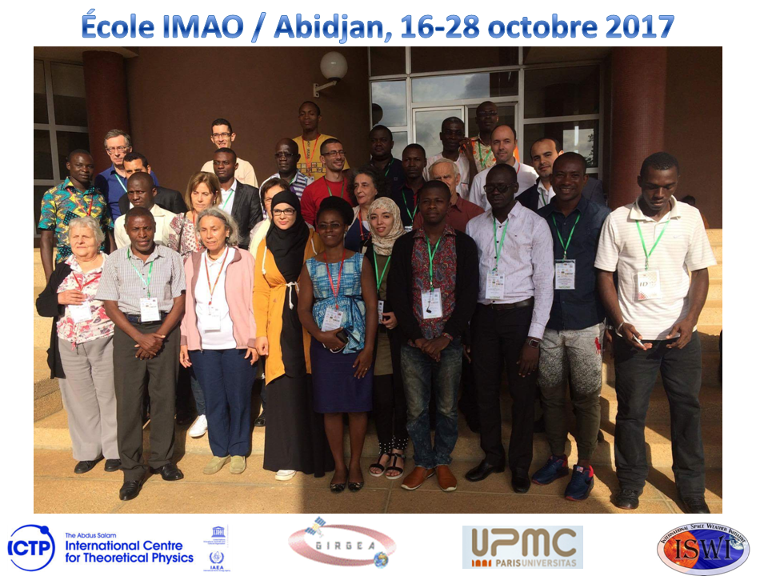

# École IMAO-Abidjan 2017
TP ([Tutoriel SID & GOES.ipynb](http://nbviewer.jupyter.org/github/astrax/IMAO_2017/blob/master/Tutoriel%20SID%20&%20GOES.ipynb)) Python pour l'école de météorologie de l'espace IMAO (ISWI Maghreb Afrique de l’Ouest) - Abidjan 2017

<h1>Introduction à Python</h1>

Ce TP a pour but l'initiation: des étudiants en mastère, des doctorants et éventuellement des enseignants, à l'utilisation de Python pour apprendre à développer des codes interfacés et adaptés à leurs projets d'étude. Les avantages de python sont multiples:
    
    * Gratuit
    * Compatibilité entre les OS
    * Plateforme unique permettant de réaliser des études diverses:
        * Intégration d'équation différentielles (Librairies pour l'analyse numérique)
        * Analyse statistique (Environnement R)
        * Calculs formels 
        * Générer des documents (Livre, articles, présentations, ...) en intégrant du texte, des images, du code interprétable
    * ...
## Langage Python

[Python] (http://www.python.org/) est un langage de programmation moderne de haut niveau, orienté objet et d'usage général.

Caractéristiques générales de Python:

* **Langage simple:** facile à lire et à apprendre avec une syntaxe minimaliste.
* **Langage concis et expressif:** moins de lignes de code, moins de bugs, plus facile à maintenir.

Détails techniques:

* **Typé dynamiquement:** Pas besoin de définir le type des variables, les arguments ou le type des fonctions.
* **La gestion automatique de la mémoire:** Aucune nécessité d'allouer explicitement et désallouer la mémoire pour les variables et les tableaux de données. Aucun bug de fuite de mémoire.
* **Interprété:** Pas besoin de compiler le code. L'interpréteur Python lit et exécute le code python directement.

### Avantages:

* Le principal avantage est la facilité de programmation, qui minimise le temps nécessaire pour développer, déboguer et maintenir le code.
* Langage bien conçu qui encouragent les bonnes pratiques de programmation:
  * Modulaire et orientée objet, permet l'encapsulation  et la réutilisation de code. Il en résulte souvent un code plus transparent, maintenable et sans bug.
  * Documentation intégré avec le code.
* De nombreuses bibliothèques standards, et de nombreux packages add-on.

### Inconvénients:

* Puisque Python est un langage de programmation interprété et typé dynamiquement, l'exécution de code python peut être lent par rapport à des langages de programmation compilés à typage statique, tels que C et Fortran.
* Un peu trop décentralisé, avec différents environnements, bibliothéques, et documentation répartis à différents endroits. Cela peut le rendre difficile pour commencer.

## Installation d'un environnement Python scientifique

[Anaconda CE](http://continuum.io/downloads.html). Anaconda Community Edition is free.

## Documents et sites Web sur Python

* [Python](http://www.python.org). The official Python web site.
* [Python tutorials](https://docs.python.org/3.6/tutorial/). The official Python tutorials.
* [Think Python](http://www.greenteapress.com/thinkpython). ''How to Think Like a Computer Scientist'' by Allen B. Downey (free book).
* [Python Course](http://python-course.eu/python3_course.php). This website contains a free and extensive online tutorial by Bernd Klein, well suited for self-learning. However, you can attend one of his Python courses in Paris, London, Toronto, Berlin, Frankfurt, Hamburg Munich or Lake Constance. 

## Cours sur github:
- ["Scientific Python Lectures"](https://github.com/jrjohansson/scientific-python-lectures) by  Robert Johansson
- ["Anatomy Of Matplotlib"](https://github.com/WeatherGod/AnatomyOfMatplotlib) by  Benjamin Root
- ["Python-lectures-Notebooks"](https://github.com/Morisset/Python-lectures-Notebooks) by Christophe Morisset
